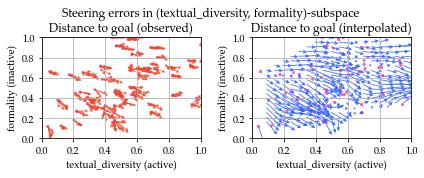

# Steerability Measurement 

This is the official repo for measuring steerability in LLMs. 



## Installation

We recommend `uv` as the package manager. Start by running
```
uv venv /path/to/your/env/ --python 3.12.8 # supported version
source /path/to/your/env/bin/activate
```

## Quickstart

Install required dependencies via `uv pip install -r requirements.txt`, followed by `bash initial_setup.sh` to pre-download some requirement NLTK and Spacy models. 

You can download the CSV of the original steerability probe via:
```
huggingface-cli snapshot download tchang97/steerbench --local-dir ./data/
```

Simply run the following:
```
CUDA_VISIBLE_DEVICES=... python steer_eval.py --config [YOUR_CONFIG] --api-config [CONFIG]
```
where `--api-config` points to a file storing a JSON with your OpenAI API key if needed (e.g., `{"api-key": "sk-..."}`).

In the provided example at `config/qwen3_example.yml`, we run the steerability probe end-to-end on Qwen3-0.6B for demonstration. This takes ~30 minutes total. **By default, the script requires manual review of rewritten texts flagged by the LLM-as-judge.** 

Supported inference providers:
* OpenAI API
* vLLM self-hosted models

In theory, any vLLM-able model should work with this repo. Here's what we've tested: 
* OpenAI API-accessible models (GPT series, o1/o3)
* Llama3
* Deepseek-R1 (distilled)
* Qwen3
* Gemma3

This repo is very early stage and likely will change without notice. Issues and contributions welcome! 

## Steerability from scratch

To measure steerability, you need to:
* Find a list of "dimensions" you care about, that you can measure (`goals.py`)
* Find a set of "seed texts" that you'd like to steer (`seed_data.py`)
* Map those seed texts into your goal-space, and generate a steerability probe (`generate_steerability_probe.py`).
* From there, you can follow the quickstart. 

The guide for building a steerability probe from scratch is under construction. 

## Feature Support

| Feature                                             | Support Level |
|-----------------------------------------------------|---------------|
| End-to-end evaluation                               | ✅ Fully supported + documented |
| Baseline set of prompt strategies                   | ✅ Fully supported + documented |
| Skip LLM as judge (set-and-forget mode)             | ⚠️ Planned |
| Generating steerability probes from custom datasets | ⚠️ Supported but undocumented  |
| Custom goals                                         | ⚠️ Supported but undocumented |
| Custom prompt strategies                            | ⚠️ Supported but undocumented  |
| RL-based fine-tuning                                | ⚠️ Supported but undocumented  |

While there are scripts supporting most of the above features, they have not been well-tested, and dependencies may differ from those in `requirements.txt`. Please an issue or reach out for support if you're interested in trying these features.

## Citation

If you find our work useful, please cite our work:
```
[FORTHCOMING]
```

## Contact

For bug reports or feature requests, please file an issue first. 

**Email:** `ctrenton` at `umich` dot `edu`
